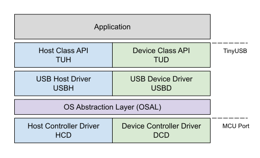

|Build Status| |CircleCI Status| |Documentation Status| |Fuzzing Status| |License|

Sponsors
========

TinyUSB is funded by: Adafruit. Purchasing products from them helps to support this project.

TinyUSB Project
===============

.. figure:: docs/assets/logo.svg
   :alt: TinyUSB

TinyUSB is an open-source cross-platform USB Host/Device stack for
embedded system, designed to be memory-safe with no dynamic allocation
and thread-safe with all interrupt events are deferred then handled in
the non-ISR task function. Check out the online `documentation <https://docs.tinyusb.org/>`__ for more details.

::

    .
    ├── docs            # Documentation
    ├── examples        # Examples with make and cmake build system
    ├── hw
    │   ├── bsp         # Supported boards source files
    │   └── mcu         # Low level mcu core & peripheral drivers
    ├── lib             # Sources from 3rd party such as freeRTOS, fatfs ...
    ├── src             # All sources files for TinyUSB stack itself.
    ├── test            # Tests: unit test, fuzzing, hardware test
    └── tools           # Files used internally

Getting started
===============

See the `online documentation <https://docs.tinyusb.org>`_ for information about using TinyUSB and how it is implemented.

We use `GitHub Discussions <https://github.com/hathach/tinyusb/discussions>`_ as our forum. It is a great place to ask questions and advice from the community or to discuss your TinyUSB-based projects.

For bugs and feature requests, please `raise an issue <https://github.com/hathach/tinyusb/issues>`_ and follow the templates there.

Check out `Getting Started`_ guide for adding TinyUSB to your project or building the examples. If you are new to TinyUSB, we recommend starting with the `cdc_msc` example.

See `Porting`_ guide for adding support for new MCUs and boards.

Device Stack
============

Supports multiple device configurations by dynamically changing USB descriptors, low power functions such like suspend, resume, and remote wakeup. The following device classes are supported:

-  Audio Class 2.0 (UAC2)
-  Bluetooth Host Controller Interface (BTH HCI)
-  Communication Device Class (CDC)
-  Device Firmware Update (DFU): DFU mode (WIP) and Runtime
-  Human Interface Device (HID): Generic (In & Out), Keyboard, Mouse, Gamepad etc ...
-  Mass Storage Class (MSC): with multiple LUNs
-  Musical Instrument Digital Interface (MIDI)
-  Network with RNDIS, Ethernet Control Model (ECM), Network Control Model (NCM)
-  Test and Measurement Class (USBTMC)
-  Video class 1.5 (UVC): work in progress
-  Vendor-specific class support with generic In & Out endpoints. Can be used with MS OS 2.0 compatible descriptor to load winUSB driver without INF file.
-  `WebUSB <https://github.com/WICG/webusb>`__ with vendor-specific class

If you have a special requirement, `usbd_app_driver_get_cb()` can be used to write your own class driver without modifying the stack. Here is how the RPi team added their reset interface `raspberrypi/pico-sdk#197 <https://github.com/raspberrypi/pico-sdk/pull/197>`_

Host Stack
==========

- Human Interface Device (HID): Keyboard, Mouse, Generic
- Mass Storage Class (MSC)
- Communication Device Class: CDC-ACM
- Vendor serial over USB: FTDI, CP210x, CH34x
- Hub with multiple-level support

Similar to the Device Stack, if you have a special requirement, `usbh_app_driver_get_cb()` can be used to write your own class driver without modifying the stack.

TypeC PD Stack
==============

- Power Delivery 3.0 (PD3.0) with USB Type-C support (WIP)
- Super early stage, only for testing purpose
- Only support STM32 G4

OS Abstraction layer
====================

TinyUSB is completely thread-safe by pushing all Interrupt Service Request (ISR) events into a central queue, then processing them later in the non-ISR context task function. It also uses semaphore/mutex to access shared resources such as Communication Device Class (CDC) FIFO. Therefore the stack needs to use some of the OS's basic APIs. Following OSes are already supported out of the box.

- **No OS**
- **FreeRTOS**
- `RT-Thread <https://github.com/RT-Thread/rt-thread>`_: `repo <https://github.com/RT-Thread-packages/tinyusb>`_
- **Mynewt** Due to the newt package build system, Mynewt examples are better to be on its `own repo <https://github.com/hathach/mynewt-tinyusb-example>`_

Supported CPUs
==============

Following CPUs are supported, check out `Supported Devices`_ for comprehensive list of driver, features for each CPU.

+--------------+------------------------------------------------------------+
| Manufacturer | Family                                                     |
+==============+============================================================+
| Allwinner    | F1C100s/F1C200s                                            |
+--------------+------------------------------------------------------------+
| Analog       | max32: 650, 666, 690. max78002                             |
|              |                                                            |
|              | max3421e (spi host)                                        |
+--------------+------------------------------------------------------------+
| Brigetek     | FT90x                                                      |
+--------------+------------------------------------------------------------+
| Broadcom     | BCM2711, BCM2837                                           |
+--------------+------------------------------------------------------------+
| Dialog       | DA1469x                                                    |
+--------------+------------------------------------------------------------+
| Espressif    | ESP32 S2, S3                                               |
+--------------+------------------------------------------------------------+
| GigaDevice   | GD32VF103                                                  |
+--------------+------------------------------------------------------------+
| Infineon     | XMC4500                                                    |
+--------------+------------------------------------------------------------+
|              | SAM:  D11, D21, D51, E5x, G55, L2x, E7x, S7x, V7x          |
|  MicroChip   |                                                            |
|              | PIC:  24, 32mm, 32mk, 32mx, 32mz, dsPIC33                  |
+--------------+------------------------------------------------------------+
| Mind Montion | mm32                                                       |
+--------------+------------------------------------------------------------+
| NordicSemi   | nRF52833, nRF52840, nRF5340                                |
+--------------+------------------------------------------------------------+
| Nuvoton      | NUC 120, 121, 125, 126, 505                                |
+--------------+------------------------------------------------------------+
| NXP          | iMXRT: RT10xx, RT11xx                                      |
|              |                                                            |
|              | Kinetis: KL, K32L2                                         |
|              |                                                            |
|              | LPC: 11u, 13, 15, 17, 18, 40, 43, 51u, 54, 55              |
|              |                                                            |
|              | MCX: A15, N9                                               |
+--------------+------------------------------------------------------------+
| Raspberry Pi | RP2040, RP2350                                             |
+--------------+-----+------------------------------------------------------+
| Renesas      | RA: 4M1, 4M3, 6M1, 6M5                                     |
|              |                                                            |
|              | RX: 63N, 65N, 72N                                          |
+--------------+-----+------------------------------------------------------+
| Silabs       | EFM32GG12                                                  |
+--------------+------------------------------------------------------------+
| Sony         | CXD56                                                      |
+--------------+------------------------------------------------------------+
| ST STM32     | F0, F1, F2, F3, F4, F7, G0, G4, H5, H7,                    |
|              |                                                            |
|              | L0, L1, L4, L4+, L5, U5, WB                                |
+--------------+------------------------------------------------------------+
| TI           | MSP430, MSP432E4, TM4C123                                  |
+--------------+------------------------------------------------------------+
| ValentyUSB   | eptri                                                      |
+--------------+------------------------------------------------------------+
| WCH          | CH32F: F20x                                                |
|              |                                                            |
|              | CH32V: V20x, V307                                          |
+--------------+------------------------------------------------------------+

License
=======

All TinyUSB sources in the ``src`` folder are licensed under MIT
license, the `Full license is here <LICENSE>`__. However, each file can be
individually licensed especially those in ``lib`` and ``hw/mcu`` folder.
Please make sure you understand all the license term for files you use
in your project.

Docs
====

- Info

  - `Uses`_
  - `Changelog`_
  - `Contributors`_

- `Reference`_

  - `Supported Devices`_
  - `Getting Started`_
  - `Dependencies`_
  - `Concurrency`_

- `Contributing`_

  - `Code of Conduct`_
  - `Structure`_
  - `Porting`_

.. |Build Status| image:: https://github.com/hathach/tinyusb/actions/workflows/build.yml/badge.svg
   :target: https://github.com/hathach/tinyusb/actions
.. |CircleCI Status| image:: https://dl.circleci.com/status-badge/img/circleci/4AYHvUhFxdnY4rA7LEsdqW/QmrpoL2AjGqetvFQNqtWyq/tree/master.svg?style=svg
   :target: https://dl.circleci.com/status-badge/redirect/circleci/4AYHvUhFxdnY4rA7LEsdqW/QmrpoL2AjGqetvFQNqtWyq/tree/master
.. |Documentation Status| image:: https://readthedocs.org/projects/tinyusb/badge/?version=latest
   :target: https://docs.tinyusb.org/en/latest/?badge=latest
.. |Fuzzing Status| image:: https://oss-fuzz-build-logs.storage.googleapis.com/badges/tinyusb.svg
   :target: https://oss-fuzz-build-logs.storage.googleapis.com/index.html#tinyusb
.. |License| image:: https://img.shields.io/badge/license-MIT-brightgreen.svg
   :target: https://opensource.org/licenses/MIT

.. _Uses: docs/info/uses.rst
.. _Changelog: docs/info/changelog.rst
.. _Contributors: CONTRIBUTORS.rst
.. _Reference: docs/reference/index.rst
.. _Supported Devices: docs/reference/supported.rst
.. _Getting Started: docs/reference/getting_started.rst
.. _Dependencies: docs/reference/dependencies.rst
.. _Concurrency: docs/reference/concurrency.rst
.. _Contributing: docs/contributing/index.rst
.. _Code of Conduct: CODE_OF_CONDUCT.rst
.. _Structure: docs/contributing/structure.rst
.. _Porting: docs/contributing/porting.rst
