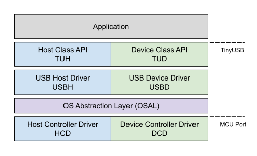

*********
Reference
*********

   representation of the TinyUSB stack.

Device Stack
============

Supports multiple device configurations by dynamically changing usb descriptors. Low power functions such like suspend, resume, and remote wakeup. Following device classes are supported:

-  Audio Class 2.0 (UAC2)
-  Bluetooth Host Controller Interface (BTH HCI)
-  Communication Class (CDC)
-  Device Firmware Update (DFU): DFU mode (WIP) and Runtinme
-  Human Interface Device (HID): Generic (In & Out), Keyboard, Mouse, Gamepad etc ...
-  Mass Storage Class (MSC): with multiple LUNs
-  Musical Instrument Digital Interface (MIDI)
-  Network with RNDIS, CDC-ECM (work in progress)
-  USB Test and Measurement Class (USBTMC)
-  Vendor-specific class support with generic In & Out endpoints. Can be used with MS OS 2.0 compatible descriptor to load winUSB driver without INF file.
-  `WebUSB <https://github.com/WICG/webusb>`__ with vendor-specific class

If you have special need, `usbd_app_driver_get_cb()` can be used to write your own class driver without modifying the stack. Here is how RPi team add their reset interface `raspberrypi/pico-sdk#197 <https://github.com/raspberrypi/pico-sdk/pull/197>`__

Host Stack
==========

- Human Interface Device (HID): Keyboard, Mouse, Generic
- Mass Storage Class (MSC)
- Hub currently only supports 1 level of hub (due to my laziness)

OS Abstraction layer
====================

TinyUSB is completely thread-safe by pushing all ISR events into a central queue, then process it later in the non-ISR context task function. It also uses semaphore/mutex to access shared resources such as CDC FIFO. Therefore the stack needs to use some of OS's basic APIs. Following OSes are already supported out of the box.

- **No OS**
- **FreeRTOS**
- **Mynewt** Due to the newt package build system, Mynewt examples are better to be on its `own repo <https://github.com/hathach/mynewt-tinyusb-example>`__

License
=======

All TinyUSB sources in the `src` folder are licensed under MIT license. However, each file can be individually licensed especially those in `lib` and `hw/mcu` folder. Please make sure you understand all the license term for files you use in your project.

Index
=====

.. toctree::
   :maxdepth: 2

   supported
   getting_started
   concurrency
