# SystemView HIL Performance Report — Design

Per-PR performance report from real hardware: SystemView captures taken during
the HIL run, compared against the base branch, posted as a sticky PR comment.
Makes TinyUSB's speed story (ISR cost, task latency, hot-function timing)
visible on every PR, and makes performance regressions reviewable the way code
size already is.

Decisions fixed during brainstorming: **approach A** (lean headline metrics,
one screen per 2 boards) · sticky PR comment · delta vs base-branch artifact ·
boards **and** workload selectable per-board in `tinyusb.json` · mermaid
charts · legend explaining every statistic.

## 1. Flow

```
HIL job (self-hosted rig, only boards both HIL-selected and sysview-flagged)
  hil_test.py passes
    → sysview_ci.py capture --board <b>          # flash SYSVIEW build, run
        → sysview-<board>.json                   # workload, RTT capture, decode,
    → reflash pristine build                     # reflash pristine
    → upload artifact sysview-<rig>

ubuntu report job in build.yml (no hardware; needs: the HIL jobs)
  download PR sysview-* artifacts
  download baseline artifact from base branch (dawidd6/action-download-artifact,
    workflow: build.yml, branch: base_ref, continue-on-error — the exact
    code-metrics pattern)
    → sysview_ci.py report base/ pr/ → sysview_report.md
    → upload artifact sysview-comment

pr_comment.yml (workflow_run, base-repo context)
  the EXISTING hil-comment job — which already combines hil-report-* artifacts
  into the "Hardware-in-the-loop (HIL) Test Report" sticky comment — also
  downloads sysview-comment and appends it to hil_combined.md

push to master
  same capture step; uploads sysview-* as the new baseline artifact
```

The posting split is load-bearing, not cosmetic: on forked PRs build.yml's
token is read-only and cannot comment — pr_comment.yml exists precisely for
this, posts even when the build failed, and already neutralizes @-mentions in
report content (fork-abuse guard, which applies to our markdown too). Riding
the HIL comment also puts the performance section where a reviewer already
looks for hardware results, instead of a third sticky comment.

Properties:

- **Non-blocking.** A capture/decode failure never fails the HIL job; the
  board's section renders as `capture failed: <reason>` and CI stays green.
- **Missing baseline** (first run after enabling, or a board newly flagged):
  absolute values, no Δ column — same degradation code-metrics uses.
- **PR-scoped HIL** (`hil_select.py` prunes boards per PR): the report compares
  only boards present in *both* PR and baseline artifact sets. If no flagged
  board ran, the comment section is omitted entirely — never a wall of
  "missing data".

## 2. Configuration — `test/hil/tinyusb.json`

Per-board opt-in block; absence means no capture for that board:

```json
"sysview": {
  "example": "device/cdc_msc",     // example to build with -DSYSVIEW=4
  "workload": "cdc_burst",         // named workload, see §4
  "duration_s": 15,                // capture window
  "buffer": 16384,                 // optional; -DSYSVIEW_BUFFER_SIZE override
  "ocd_args": "..."                // optional; OpenOCD interface+target args for
}                                  // the RTT capture. Defaults to the flasher's
```                                // args — which only works when the flasher is
                                   // openocd-family. jlink/stlink-flashed boards
                                   // must set it (e.g. f407: "-f interface/jlink.cfg
                                   // -c \"transport select swd\" -f target/stm32f4x.cfg")

Both the board set and the workload are config, not code — changing either is
a `tinyusb.json` edit, no harness change.

## 3. `test/hil/sysview_ci.py` (new, standalone)

`hil_test.py` is untouched. Two subcommands with a hard purity split:

### `capture` — runs on the rig, needs hardware

Board selection is the intersection of "sysview-flagged in the json" and
"tested by this job": `capture` accepts the same `-b/--board` append syntax as
`hil_test.py`, and the workflow step passes it the identical selection
arguments (`matrix.test_args` + the `hil_select.py` args) that the test step
received. No args = all flagged boards in the json.

Per selected board: build `example` with `-DSYSVIEW=4` (+ buffer override) →
flash via **`hil_flash.py`**'s per-flasher functions (verified: `flash_jlink`
/ `flash_openocd` / `flash_openocd_wch` / `flash_stlink` …, signature
`(board, firmware)` where `firmware` is the extension-less base path — the
SYSVIEW build lives in its own build dir, so `capture` passes that path
explicitly rather than using `find_firmware`, which only searches
`cmake-build-<variant>`) → wait for enumeration →
start OpenOCD RTT (`rtt setup` from the ELF symbol table, **`rtt
polling_interval 1`**, never `reset run` inside a WCH session) → run the named
workload for `duration_s` → decode via `sysview_record.py --from-raw` +
`sysview_report.py --json` → write `sysview-<board>.json` → **reflash the
pristine build**. Board locks held for the whole sequence via `hil_lock.py`'s importable
`acquire_board_lock()` (no CLI subprocess).

Output schema (one file per board):

```json
{
  "board": "stm32f407disco", "commit": "a1b2c3d",
  "example": "device/cdc_msc", "workload": "cdc_burst", "duration_s": 15,
  "capture": {"route": "openocd-rtt", "poll_ms": 1, "live_window_s": 14.2},
  "metrics": { ... verbatim sysview_report.py --json object ... },
  "error": null                    // or "flash failed: ...", metrics absent
}
```

### `report` — pure, no hardware, unit-testable

`report <base-dir> <pr-dir> -o report.md`. Reads both JSON sets, joins on
board name, emits the markdown of §5. No network, no subprocess — fixture
JSONs in, deterministic markdown out.

## 4. Workloads

Named functions inside `sysview_ci.py`, selected by name from `tinyusb.json`:

- **`cdc_burst`** (default): open the board's CDC node
  (`/dev/serial/by-id/usb-TinyUSB_*`), fixed pattern — 300 ms of 64-byte
  write/read bursts, 1.0 s idle, repeated for `duration_s`. Deterministic, so
  run-to-run deltas are meaningful; the idle gaps double as the timestamp
  sanity check (median gap ≈ 1.000 s).
- **`idle`**: enumerate and sit. For boards with no drivable node (host-role
  boards drive their attached devices themselves).

Adding a workload = one function + a name; no schema change.

## 5. The comment

Appended to the existing sticky comment. Canonical example (real numbers from
the 2026-07 pool dogfoods; one `###` section per board):

---

## ⚡ SystemView performance — HIL

*cdc_msc `SYSVIEW=4`, workload `cdc_burst` 15 s, OpenOCD rtt @1 ms · base `2d56dc5` → PR `a1b2c3d`*

### stm32f407disco (M4 · DWT) — live 14.2 s

| metric | base | PR | Δ |
|---|---:|---:|---:|
| ISR 83 p50 / p99 | 6.7 / 9.2 µs | 6.8 / 9.2 µs | +1.5% / — |
| `tud_task` p50 | 7.4 µs | 7.4 µs | — |
| `tud_cdc_read` p50 | 6.9 µs | 6.2 µs | **−10.1%** ✅ |
| `dcd_edpt_xfer` p50 | 5.9 µs | 6.1 µs | +3.4% |
| CPU load (usbd ctx) | 4.6 % | 4.4 % | −0.2 pt |
| `usbd` stack high-water | 684 B | 684 B | — |

```mermaid
xychart-beta
    title "hot functions p50 µs (base vs PR)"
    x-axis [tud_task, cdc_read, cdc_flush, mscd_cb, dcd_xfer]
    y-axis "µs" 0 --> 12
    bar [7.4, 6.9, 2.8, 10.2, 5.9]
    bar [7.4, 6.2, 2.9, 10.0, 6.1]
```



### raspberry_pi_pico (M0+ · 1 MHz timer) — live 14.3 s

| metric | base | PR | Δ |
|---|---:|---:|---:|
| `tud_task` p50 | 19.0 µs | 19.0 µs | — |
| `tud_cdc_read` p50 | 24.1 µs | 21.8 µs | **−9.5%** ✅ |
| `dcd_edpt_xfer` p50 | 10.0 µs | – ⚠︎ overflow 3 | — |
| CPU load (usbd ctx) | 7.1 % | 7.0 % | — |

<sub>**Legend** — **p50/p99**: median / 99th-percentile duration over all calls
in the capture window (µs; p50 = typical cost, p99 = tail latency). **Δ**:
change vs base branch; **−** is faster/better. **pt**: percentage points.
**CPU load**: context's share of the live capture window. **stack
high-water**: peak bytes of stack used. Function rows/bars are ordered by CPU
occupancy (calls × p50) in the PR capture, hottest first. **– ⚠︎**: metric withheld — RTT ring
overflowed (`overflow N`) or too few samples (`n<50`); withheld beats wrong.
`max` is never shown: under overflow it splices two invocations into one bogus
duration. Capture: OpenOCD RTT @1 ms poll — p50/p99 match the J-Link recorder
within ~1%.</sub>

---

Metric rows per board: ISR p50/p99 first (one row per USB ISR), then the
function rows **sorted by CPU occupancy** — `n × p50` over the live window,
descending, computed from the PR side (base side follows the same row order) —
then per-context CPU load (usbd/usbh context) and stack high-water per task
(FreeRTOS builds only). The function universe is the instrumented
`tu_sysview_id_t` sites, so today ≤6 rows per role appear; sorting makes the
first row "biggest CPU consumer", and the layout holds unchanged if
instrumentation grows. One mermaid chart per board: functions in the same
occupancy order, **capped at 8 bars**, two bar series (base, PR). The legend
appears once, after the last board section (and defines occupancy ordering).

## 6. Validity gates

Wrong numbers are worse than no numbers; every rule is mechanical:

| condition | rendering |
|---|---|
| `metrics.overflow > 0` (single source; not duplicated in `capture`) | every duration metric from that capture: `– ⚠︎ overflow N` |
| metric `n < 50` | that metric: `– ⚠︎ n=<n>` |
| gate fails on either side | Δ omitted; passing side shown absolute |
| capture/decode error | board section: `capture failed: <reason>` (from `error` field) |
| board absent from baseline | absolute values, Δ column `new` |
| no flagged board ran | entire comment section omitted |
| `max` | never rendered, anywhere |

## 7. Reporter prerequisites (bug fixes in `sysview_report.py`)

Both are existing silent-wrong-answer bugs; deltas built on them would lie.

1. **Spliced pairs.** A lost record makes the decoder pair one invocation's
   CALL with a later invocation's RET (measured: 134 ms "max" on a function
   whose p99 is 10 µs). Fix: track pairing depth per function id; when a CALL
   arrives while one is open, or a RET arrives with none open, discard that
   sample and count it in a new `dropped_pairs` field instead of emitting a
   duration.
2. **Stale boot window.** The export contains boot-time records still in the
   RTT ring, so a quiet capture's `cpu%` averages over dead air (measured:
   111 s span, 98 s of it idle). Fix: split the event stream on any
   inter-event gap > 2 s before the first workload event; compute all
   statistics over the live window only; report `live_window_s`.

Both fixes land in `sysview_report.py` itself (with `--json` fields
`dropped_pairs` and `live_window_s`), so the skill's ad-hoc use benefits too.

## 8. Workflow wiring

- `build.yml` HIL jobs: after the `hil_test.py` step, a
  `continue-on-error` capture step —
  `python3 test/hil/sysview_ci.py capture --json $HIL_JSON --out sysview/`
  (internally: only boards this job just tested AND flagged in the json) —
  then `upload-artifact sysview-<rig>`.
- Master pushes upload the same artifact; it is the next PR's baseline.
- Report job (ubuntu, alongside the code-metrics comment job): download both
  sides, run `report`, append to the sticky comment. Skips cleanly when the
  PR produced no sysview artifacts.

## 9. Testing

- **TDD on `report`** (pure): fixture base/PR JSON pairs → expected markdown.
  Cases: normal delta, gated metric (overflow, low-n), one-sided gate,
  missing baseline, capture-failed board, empty intersection, legend
  presence, mermaid series alignment.
- **Reporter fixes**: unit fixtures with synthetic event streams — spliced
  CALL/RET sequences and a stale-boot + live-window stream — asserting
  `dropped_pairs` / `live_window_s` and the corrected statistics.
- **Capture live-verified on ci.lan** against two flagged boards
  (stm32f407disco, raspberry_pi_pico) before any workflow edit.
- **Comment rendering**: paste generated markdown into a scratch PR comment
  once to confirm GitHub renders the mermaid blocks.

## Out of scope (deliberately)

Regression thresholds/auto-flagging (needs jitter data first — collect it from
real PR traffic), manual-parity extras (Time Interrupted, quartile charts,
run-time/s jitter — additive later), job-summary second tier, trend storage
beyond the single rolling baseline artifact, Espressif boards (no SYSVIEW
build path), Make builds.
