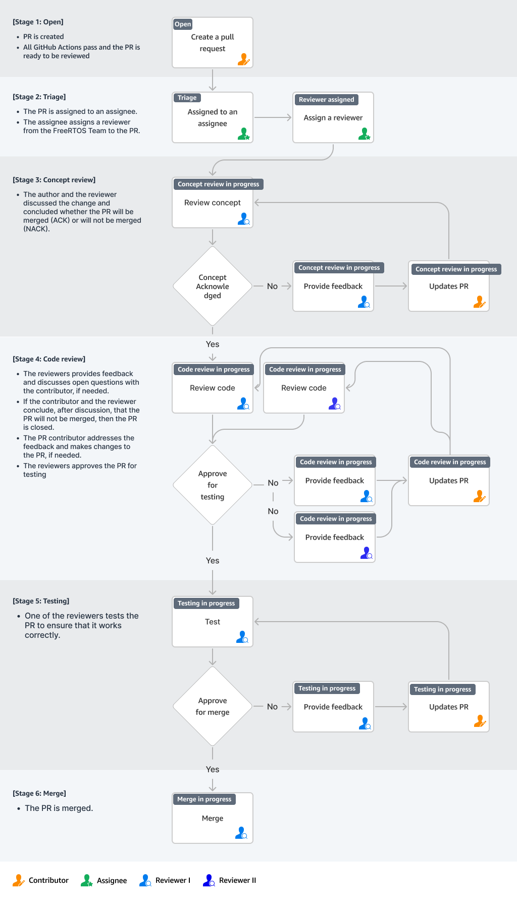

# Pull Request Process

This document explains the stages that a Pull Request (PR) goes through when a pull request is submitted to a git repository in the FreeRTOS organization in Github. Before you start a PR, please read and familiarize yourself with [CONTRIBUTING.md](CONTRIBUTING.md)

## ****Terminologies****

**FreeRTOS Partner Contributors**: These are selected developers and experts from community. 

**FreeRTOS Team**: The FreeRTOS team consists of “AWS employees”. 

**CODEOWNERS**: For all the FreeRTOS repositories, “FreeRTOS Team” and/or “FreeRTOS Partner contributors” will be CODEOWNER.

**Contributor**: The Contributor is the person who submitted the pull request.

**Assignee**: The Assignee is an AWS Employee who is responsible for identifying reviewers  and managing the PR. They track the progress of pull requests and ensure that they are reviewed and merged in a timely manner. 

**Reviewer**: Reviewers are responsible for reviewing pull requests and providing feedback to the contributor. Two approving reviews, one of which must be from the CODEOWNER of the reposiroty, are required for a PR to be merged. 

## ****Pull Request Life-Cycle****

Once a pull request (PR) is submitted, it goes through the following stages:

1. Open
    1. The PR is created.
    2. All the GitHub Actions pass and the PR is ready to be reviewed. 
2. Triage
    1. The PR is assigned to an assignee.
    2. The assignee assigns a reviewer from the FreeRTOS Team to the PR.
3. Review
    1. The reviewer provides feedback and discusses open questions with the contributor, if needed.
    2. If the contributor and the reviewer conclude, after discussion, that the PR will not be merged, then the PR is closed.
    3. The PR contributor addresses the feedback and makes changes to the PR, if needed.
    4. The reviewer approves the PR and assigns a second reviewer.
4. Second Review
    1. The second reviewer reviews the PR and provides feedback, if needed.
    2. The PR contributor addresses the feedback and makes changes to the PR, if needed.
    3. The second reviewer approves the PR.
5. Testing
    1. One of the reviewers tests the PR to ensure that it works correctly.
6. Ready to Merge  
   A PR becomes Ready to Merge when all the branch protection rules are satisfied. We have branch protection rules which require the following:
    1. At least 2 reviews. 
    2. One review from the CODEOWNER of the given repository. 
    3. All PR checks must pass.
7. Merge
    1. The PR is merged.

 

The status of a PR is indicated through GitHub labels added by Reviewers/Assignees. The following are the most common status indicators: Triaged, Reviewer Assigned, Concept ACK/NACK, First Code Review In Progress, First Code Review Complete, Second Code Review In Progress, Second Code Review Complete, Testing In Progress and Testing Complete.

Please note that we may decide to skip some stages depending on the type of PR. For example, a PR with a simple doc update will likely not go through all the above stages, however every PR is required to get approvals from 2 reviewers.

The pictorial representation of our PR process is shown below.

 

## **Turnaround Times**

The length of time required to review a PR is unpredictable and varies from PR to PR since it depends on the complexity of the changes, availability of reviewers, and overall workload of the team. We generally attempt to resolve each PR in accordance with the timeframes below, excluding weekends and public holidays:

* Triage: < 24 hours
* Concept ACK/NACK: 1-2 weeks
* Code Review: 1-2 weeks
* Testing: 1-2 weeks

## **Addressing the changes requested by reviewers**

The author should address any review comments in 4 weeks or less. If the author is unable to address the comments in that time, we will do one of the following:

* Make the required changes ourselves and merge the pull request.
* Close the pull request.

 

### **Best Practices for Faster Reviews**

Here are some best practices to follow so that your PR gets reviewed quickly. 

1. If you plan to contribute a new feature to FreeRTOS, please get confirmation beforehand that the FreeRTOS team and community want, and will accept, this feature. This is true especially when you plan to make large or significant changes.  To get confirmation and feedback from FreeRTOS Team and  community, create a post in the FreeRTOS forums. 
2. Smaller is better. Small, focused PR’s are reviewed more quickly and thoroughly, are simpler to rollback, and involve less wasted effort if rejected.  Avoid opening pull requests that span the whole repository.
3. Don’t mix refactoring, bug fixes and feature development into a single PR. Lets say you are developing feature-x  and you come across poorly named variables or incomplete/incorrect comments. You should consider fixing those, but in a separate PR, not in the same PR as feature-x. 
4. Comments matter. The code you develop will need to be maintained for a long time. Well placed comments provide context to your reviewers, maintainers and users, and also prevent them from misunderstanding the purpose of the code.  However, DO NOT add comments to explain things which are obvious by just glancing at the code. [Good Read: https://stackoverflow.blog/2021/12/23/best-practices-for-writing-code-comments/]
5. Test your PR. In your PR, please accompany your changes with suitable unit tests and any other tests that will be helpful, and include descriptions of how to perform any manual tests. Instructions for unit tests can be found at [freertos.org](https://freertos.org/FreeRTOS-Coding-Standard-and-Style-Guide.html#Testing) and [Github](https://github.com/FreeRTOS/FreeRTOS/blob/main/FreeRTOS/Test/CMock/Readme.md)

**Push Back its ok:**
Sometimes reviewers make mistakes. If a reviewer has requested you to make changes and you feel strongly about doing it a certain way, you are free to debate the merits of the requested change with the reviewer, while still following the code of conduct. You might be overruled, but you might also prevail. 

**Be Pragmatic**
Put a bit of thought into how your PR can be made easier to review and merge. No document can replace common sense and good taste. The best practices shared here and the contribution guidelines, if followed, will help you get your code reviewed and merged with less friction. 

 

### **Why is  my PR closed?** 

Pull requests older than 120 days or not in-line with scope of the project will be closed. Exceptions can be made for pull requests that have active review comments, or that are awaiting other dependent pull requests. Closed pull requests are easy to recreate, and little work is lost by closing a pull request that is subsequently reopened. We want to limit the total number of pull requests in flight to:

* Maintain a clean project
* Remove old pull requests that would be difficult to rebase since the underlying code has changed over time
* Encourage code velocity

### **Why is my PR not getting reviewed/merged?**

* It may be because of a feature freeze due to an upcoming release. During this time, only bug fixes are taken into consideration. If your pull request is a new feature, it will not be prioritised until after the release. Wait for the release.
* It could be related to best practices (see contributing.md) not being followed. One common issue is that the pull request is too big to review. Let’s say you’ve touched 21 files and have 9347 insertions. When your would-be reviewers pull up the diffs, they run away - this pull request is going to take a few hours to review and they don’t have a few hours right now. They’ll get to it later, just as soon as they have more free time (ha!).
* If you think the above two situations are not the reason, and you are not getting some pull request love,  please drop a couple of reminders on the PR comments. If everything else fails, please create a post on FreeRTOS forums with link to PR. 

